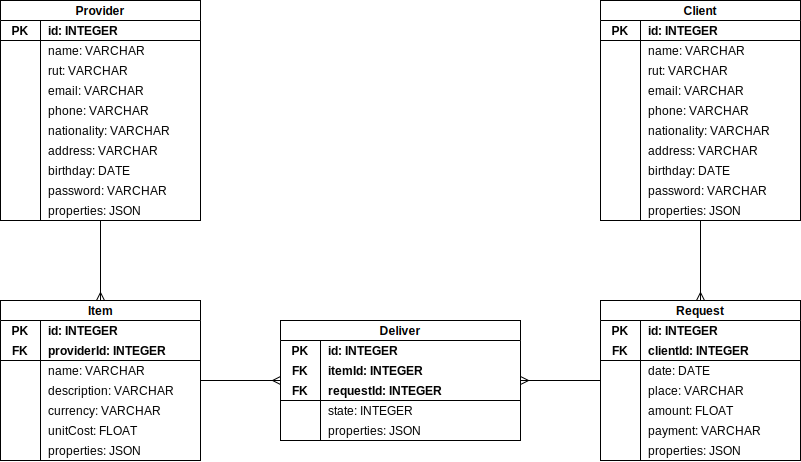

# backend_01: Delivering Goods and Services

This backend provides an API for manipulating a database that represents the process of delivering goods and services. Made in NestJS.

## Features

### Provider/Client
### Item
### Request
### Deliver
